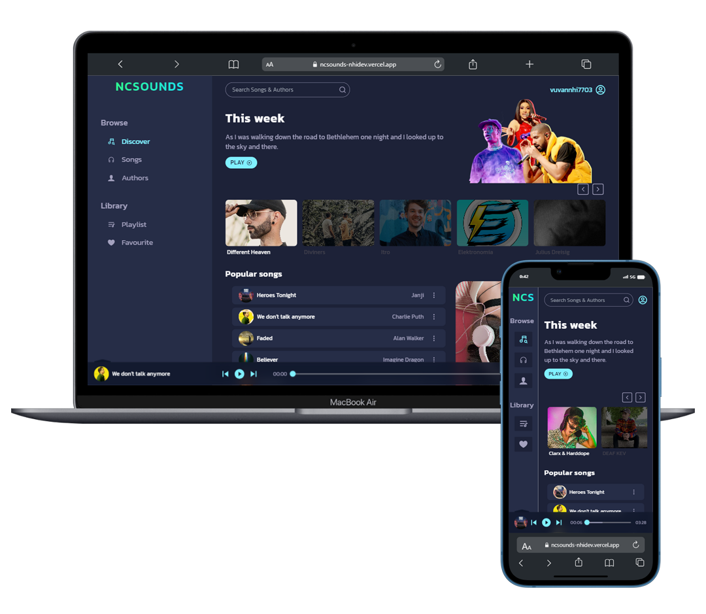

<h2 align="center">
  NCSounds - <a href="https://nhideveloper.id.vn" target="_blank">Nhideveloper</a>
</h2>

  

<h2 align="center">
  
  [<kbd>   VIEW DEMO   </kbd>][KBD]
  
</h2>

## Decription

NCSounds is a free NCS music listening web interface. I created this project while learning how to handle data from the backend (mock data) to display on the user interface.

## Built With

This project was built using these technologies.

- Vite
- React.js
- TailwindCSS
- CSS3
- React-router-dom
- Cloudinary
- Splidejs
- VsCode
- Vercel

## Feature

**️🎧 Audio Player**

**🔎 Search Mucsic**

**💟 Favorite Lists**

**📚 Create Playlists**

**️🎵 Download Mucsic**

**📱 Fully Responsive**

## Other

Source mucsic fromThe sources of the songs I gathered from include: `ncs.io`  `jesusful`  `cloudmp3`

**⚠️ Some links may be broken, I will update them as soon as possible.**

[KBD]: https://ncsounds-nhidev.vercel.app
